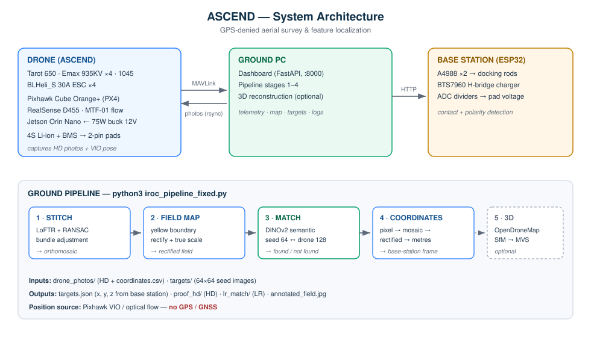
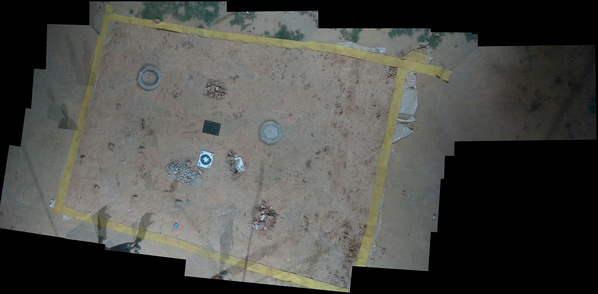
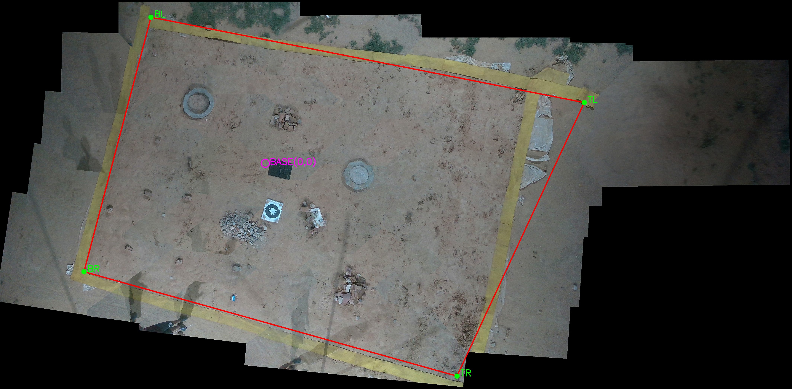
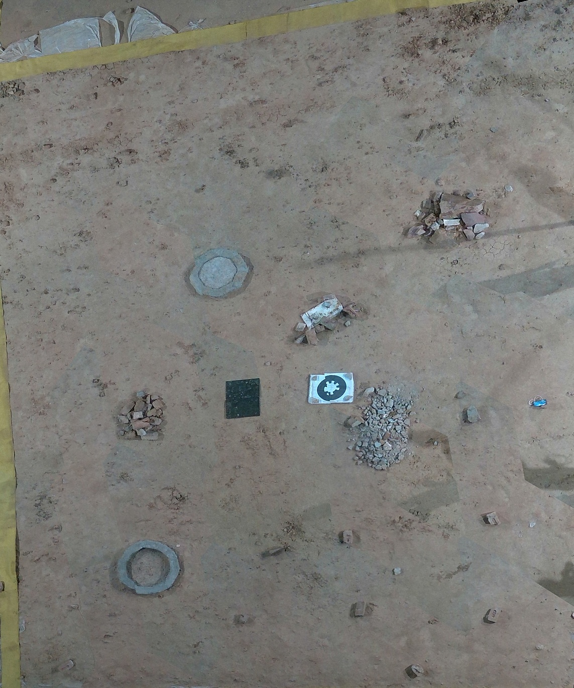
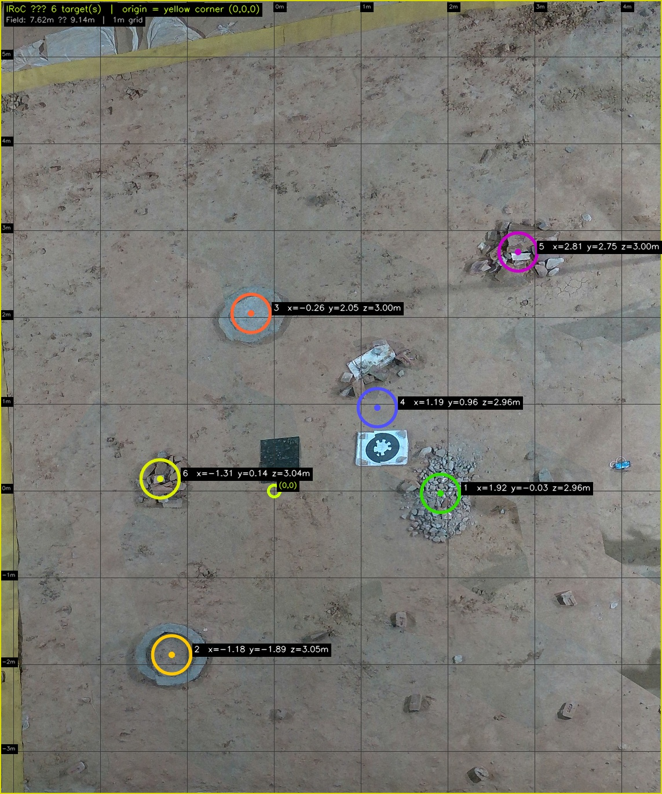
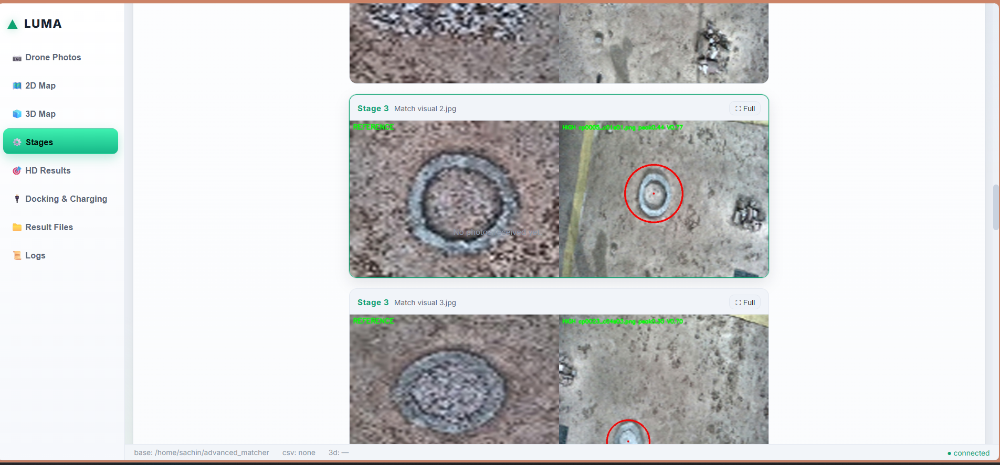

# ASCEND — Autonomous Survey & Feature Localization
### GPS-denied aerial mapping and object localization

**A drone flies itself over an arena and takes photos. This software tells you exactly where the
objects of interest are — in metres, without GPS.**

The drone takes off on optical flow, hands over to visual odometry only after proving it is
trustworthy, flies a lawnmower survey inside a yellow boundary it can see, and lands itself on a
marker. The photos are then stitched into one map, each reference object is found with a
deep-learning matcher, and its coordinates are reported relative to the base station.

Position comes from the drone's camera and Pixhawk visual-inertial odometry — **no GPS anywhere**.
GPS is accurate to metres; this task needs ~0.1 m, and it is unavailable indoors.



---

# 1 · The drone and the survey


## How a survey flight works

| Phase | What the drone does | Position source |
|---|---|---|
| **Take off** | Climbs to 3 m | **Optical flow only** |
| **Settle** | Holds still so flow stabilises | Flow |
| **Yaw align** | Locks the survey grid to its own settled heading | Flow |
| **Seed** | Resets visual odometry and captures the frame alignment | Flow |
| **Validate** | Flies a small square while the VIO gate scores its health | Flow |
| **Handover** | Gate opens — vision starts feeding the flight controller | Flow **+ VIO** |
| **Survey** | Flies the lawnmower grid, hovers and captures a photo at each checkpoint | Fused |
| **Return** | Flies home | Fused |
| **Land** | Gate closes, EKF settles, precision descent onto a marker | **Flow only** |

The idea that makes it safe: **optical flow always runs underneath.** Visual odometry is only
*added on top*, and only after it earns it. If the camera fails at any moment the gate closes and
the drone is still flying normally — the loss costs accuracy, not control.

```bash
ros2 launch viman_mission survey_boundary.launch.py boundary_start_corner:=back_left
```

- **Yellow-boundary safety** — a live detector publishes a repulsion field so the drone can never
  lead within 0.5 m of any arena line, in autonomous *or* manual flight.
- **Autonomous corner finding**, marker precision landing, and a stick-clamp guard for manual flying.

→ [09 — Drone Software](docs/09_DRONE_SOFTWARE.md) · [10 — VIO & Localization](docs/10_VIO_LOCALIZATION.md)

---

# 2 · Hardware


| Part | Component |
|---|---|
| Frame | Tarot TL65B01 Iron Man 650 (folding quad) |
| Motors / props / ESCs | EMAX **935 KV** ×4 · **1045** props · LittleBee BLHeli_S **30 A** ×4 (on **AUX OUT**) |
| Flight controller | **Pixhawk Cube Orange+** — PX4 |
| Companion computer | **NVIDIA Jetson Orin Nano** — powered by a 75 W buck converter at 12 V |
| Camera | **Intel RealSense D455**, mounted facing straight down |
| Optical flow | **MTF-01** (flow + rangefinder) |
| Power | 4S Li-ion + BMS → **2-pin** charging pads on the landing gear |
| Base station | ESP32 · A4988 ×2 (docking rods) · BTS7960 (charger) · ADC dividers (pad voltage) |

Full component list, **complete wiring tables** (every connection, both machines) and photos:
→ [01 — Hardware](docs/01_HARDWARE.md)

---

# 3 · Feature detection (ground pipeline)

Give it the survey photos plus a small reference image of what to look for:

| # | Stage | What happens | Main file |
|---|---|---|---|
| 1 | **Stitching** | Overlapping HD photos → one top-view orthomosaic (LoFTR + bundle adjustment) | `iroc_pipeline.py` |
| 2 | **Field map** | Detect the yellow arena boundary → rectify to a straight, true-scale rectangle | `iroc_pipeline.py` |
| 3 | **Target matching** | Find each 64×64 seed inside the drone's 128×128 photos (**DINOv2 semantic**) | `stage3_robust.py` |
| 4 | **Coordinates** | Target pixel → mosaic → rectified → metres, relative to the base station | `iroc_pipeline_fixed.py` |
| 5 | **3D map** *(optional)* | Photogrammetry → textured 3D model + elevation map | `3d.py` |

```bash
python3 iroc_pipeline_fixed.py
```

**Why a semantic matcher:** the target is seen at a different height, angle, rotation and lighting
than the reference, on low-texture ground. Template matching compares raw pixels and breaks;
SIFT-style matchers need repeatable keypoints that plain paving does not provide. DINOv2 embeddings
encode *what a thing is*, which survives all of that.

## What it produces

| **Stage 1** — stitched orthomosaic | **Stage 2** — detected boundary |
|:---:|:---:|
|  |  |
| ~35 overlapping photos joined into one map | The 4 yellow corners found on the mosaic |

| **Stage 2** — rectified, true-scale arena | **Stage 4** — annotated result |
|:---:|:---:|
|  |  |
| Straightened and scaled to the real arena size | Each target circled with its coordinates |

**Stage 3 — target matching, shown live in the dashboard**
*(left: the 64×64 seed · right: where it was found in the survey, circled)*



## Results

Validated on real flight data over a 35 × 25 ft arena:

- All target features detected and localized, **no false positives**
- Coordinates relative to the base station, in metres, **GPS-free**
- Accuracy ≈ **0.1 m** on distinct features
- Per target: a low-resolution image, a high-resolution proof image and the coordinates

More debug views: [`docs/images/`](docs/images/) · Expected output: [`examples/`](examples/)
→ [07 — Stage Guide](docs/07_STAGE_GUIDE.md) · [How It Works](HOW_IT_WORKS.md)

---

# 4 · Dashboard, docking and automation

**Live web dashboard** (`base_station/`) — telemetry, camera feed, arena map, detected targets,
logs, and one-click pipeline runs.

```bash
python3 -m base_station.server        # http://localhost:8000
```

**Auto-docking and charging** (`esp32_firmware/`) — the ESP32 drives two rods to seat the drone,
detects contact **and polarity** (so it can land either way round), measures pack voltage and runs
the charger.

**End-to-end automation** — after touchdown, no human action is needed:

```
land → notify base station → docking + charging starts
     → survey data rsyncs to the PC → pipeline runs itself → results appear
```

→ [02 — Docking & Charging](docs/02_DOCKING_CHARGING.md) · [12 — End-to-End Automation](docs/12_END_TO_END_AUTOMATION.md)

---

# 5 · Quick start

```bash
git clone https://github.com/s-k-0-1/gps-denied-drone-survey.git
cd gps-denied-drone-survey

pip install -r requirements.txt --break-system-packages

# prove it works with synthetic data, no drone needed
python3 make_test_dataset.py
cp -r ~/advanced_matcher_testset/drone_photos ./
cp -r ~/advanced_matcher_testset/targets ./
python3 iroc_pipeline_fixed.py
```

With real data: put HD photos + `coordinates.csv` in `drone_photos/`, seed images in `targets/`,
then run the same command. Results appear in `results/`.

Full install for all three machines → [00 — Install Everything](docs/00_INSTALL_EVERYTHING.md)

---

# 6 · Documentation

Written for someone who has never seen this project before. Read in order.

| Doc | What's inside |
|---|---|
| **[00 — Install Everything](docs/00_INSTALL_EVERYTHING.md)** | All three machines from zero, in the order you use them: **A** drone → **B** ground PC → **C** ESP32 |
| **[01 — Hardware](docs/01_HARDWARE.md)** | Build photos, component list, **complete wiring tables**, power distribution, safety |
| **[02 — Docking & Charging](docs/02_DOCKING_CHARGING.md)** | ESP32 firmware: docking sequence, contact + polarity detection, voltage measurement, charging state machine |
| **[03 — Data Transfer](docs/03_DATA_TRANSFER.md)** | Photos and telemetry from drone → Jetson → ground PC; MAVLink routing; file layout |
| **[04 — Pipeline / Feature Detection](docs/04_PIPELINE.md)** | Stage-by-stage detection, and what **every file** does |
| **[05 — Setup](docs/05_SETUP.md)** | Ground-PC installation walkthrough (expanded version of 00's Part B) |
| **[06 — Git & GitHub](docs/06_GIT_GITHUB.md)** | Complete beginner's guide to git |
| **[07 — Stage Guide](docs/07_STAGE_GUIDE.md)** | Per-stage: what runs, which file, the few parameters that matter, how to fix it |
| **[08 — Troubleshooting](docs/08_TROUBLESHOOTING.md)** | Every symptom → fix, in one table |
| **[09 — Drone Software](docs/09_DRONE_SOFTWARE.md)** | The ROS 2 stack: architecture, every node, missions, boundary safety |
| **[10 — VIO & Localization](docs/10_VIO_LOCALIZATION.md)** | Optical flow + RTAB-Map, the gated handover, **loop closure**, camera-failure behaviour |
| **[11 — Pixhawk & PX4](docs/11_PIXHAWK_PX4.md)** | Wiring, MAVROS config, PX4 parameters for GPS-denied flight, tuning order |
| **[12 — End-to-End Automation](docs/12_END_TO_END_AUTOMATION.md)** | What happens automatically after touchdown |
| **[13 — Operations Runbook](docs/13_OPERATIONS.md)** | **Every command, with a test after every step** — setup → bench tests (props off) → ground tests → first flights in risk order |
| [How It Works](HOW_IT_WORKS.md) | Full algorithm explanation + the design decisions behind them |
| [Parameters Guide](PARAMETERS_GUIDE.md) | Every tunable parameter, when to change it and why |
| [Run Guide](RUN_GUIDE.md) | Run + validation checklist |
| [64×64 Mode](PARAMETERS_64x64.md) | Tuning for the alternate 64×64 matching mode |

---

# 7 · Repository structure

```
gps-denied-drone-survey/
├── iroc_pipeline_fixed.py     ← MAIN entry point (all fixes applied)
├── iroc_pipeline.py           ← base pipeline: stitching, field map, annotation
├── stage3_robust.py           ← target matcher (DINOv2 semantic)
├── fused_search.py            ← shared model loading + image helpers
├── 3d.py                      ← optional 3D reconstruction (OpenDroneMap)
├── make_lr.py                 ← build LR seed images from full-res references
├── make_test_dataset.py       ← synthetic dataset generator (for testing)
│
├── drone/                     ← ON-DRONE software (Jetson, ROS 2)
│   ├── viman_mission/         ← main ROS 2 package
│   │   ├── viman_mission/     ← nodes: mission_director, survey_mission, vio_gate,
│   │   │                         rs_pipeline, yellow_boundary_detector, boundary_guard,
│   │   │                         whycode_detector, precision_land, vision_bridge …
│   │   ├── launch/            ← bringup / survey_boundary / boundary_guard / hsv_calibrate
│   │   └── config/            ← mission_params.yaml  (ALL tuning lives here)
│   ├── whycode-ros2/          ← fiducial marker detection (C++) for precision landing
│   ├── whycode_interfaces/    ← marker message + service definitions
│   ├── scripts/               ← landing_transfer_node.py — auto data transfer on touchdown
│   ├── legacy/                ← earlier standalone scripts, kept for reference
│   ├── px4_params.params      ← exported PX4 parameters (EKF2, failsafe, PIDs)
│   ├── px4_config.yaml        ← MAVROS plugin configuration
│   ├── px4_pluginlists.yaml   ← which MAVROS plugins load
│   ├── main.conf              ← mavlink-router routing
│   ├── cyclonedds.xml         ← ROS 2 DDS configuration
│   └── landing-transfer.service ← systemd unit for the auto transfer
│
├── base_station/              ← live web dashboard (FastAPI + WebSocket)
│   ├── server.py              ← REST + WebSocket API, image serving
│   ├── config.py              ← all paths / environment settings
│   ├── pipeline_runner.py     ← runs the pipeline as a subprocess, streams logs
│   ├── results_store.py       ← reads results/, auto-refresh watcher
│   ├── drone_link/            ← MAVLink link + simulator (hot-swappable)
│   └── static/                ← dashboard UI (HTML/CSS/JS)
│
├── esp32_firmware/            ← docking + charging firmware (Arduino)
├── docs/                      ← all documentation (start here)
│   └── images/                ← build photos, results, architecture diagrams
├── examples/                  ← what a successful run produces
│
├── drone_photos/              ← INPUT: HD photos + coordinates.csv   (not in git)
├── targets/                   ← INPUT: seed images                    (not in git)
└── results/                   ← OUTPUT: mosaic, field map, targets    (not in git)
```

---

# 8 · Key design decisions

- **No GPS/GNSS.** Camera + Pixhawk VIO / optical flow. GPS gives metres; this needs ~0.1 m.
- **Optical flow is the floor, not the fallback.** It always runs; VIO is added on top only after a
  scored validation, and is dropped the instant it misbehaves.
- **Coordinates measured in the rectified arena frame**, not by integrating VIO — so error does not
  grow with flight time.
- **Semantic matching, not template matching.** DINOv2 survives rotation, lighting and scale change.
- **Scale from known arena dimensions**, which cancels VIO scale error.
- **Landing is always flow-only**, with the gate closed *before* descent begins.

---

# 9 · Security note

The repository ships with **placeholders and defaults, not real credentials**. Set your own before
deploying:

| What | Where | Default |
|---|---|---|
| WiFi SSID / password | `esp32_firmware/full_base_station_wifi.ino` | `YOUR_WIFI_SSID` / `YOUR_WIFI_PASSWORD` |
| Ground-PC address | same file, `BASE_URL` | `http://192.168.1.100:8000` |
| Machine token | ESP `DOCK_TOKEN` = Jetson `DOCK_TOKEN` = dashboard `IROC_TOKEN` | `CHANGE_ME` |
| Transfer target | Jetson service env: `PC_USER`, `PC_IP`, `PC_DEST_PATH` | placeholders |
| Dashboard login | env `IROC_USER` / `IROC_PASS` | `luma` / `ascend2026` |

```bash
IROC_USER=yourname IROC_PASS='a-strong-password' IROC_TOKEN='your-token' \
    python3 -m base_station.server
```

Never commit real WiFi passwords, tokens or private IP addresses.

---

## Credits

Built by **Team LUMA**, The LNM Institute of Information Technology, Jaipur — originally developed
for the ISRO Robotics Challenge (IRoC-U 2026).

## License

MIT — see [LICENSE](LICENSE).
