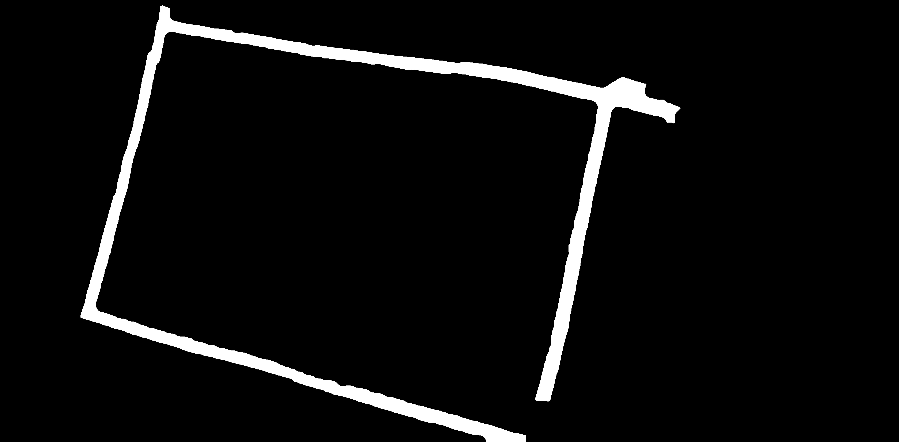
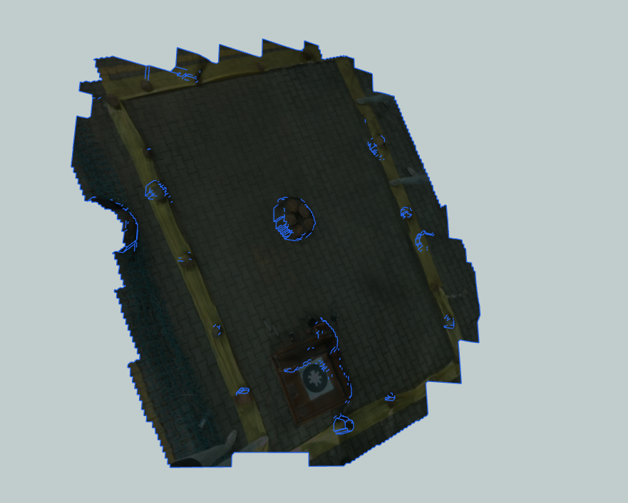
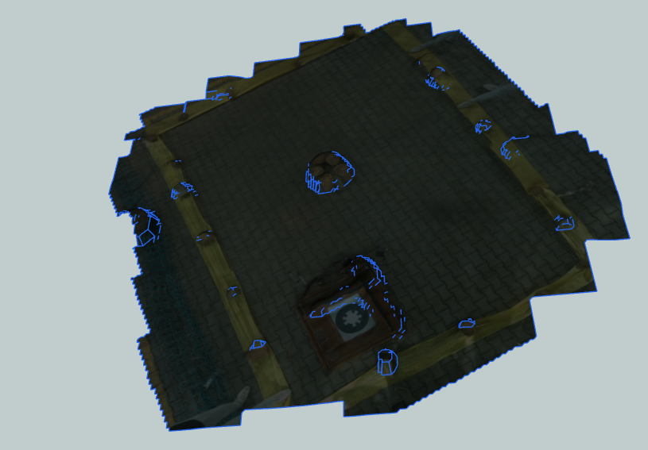
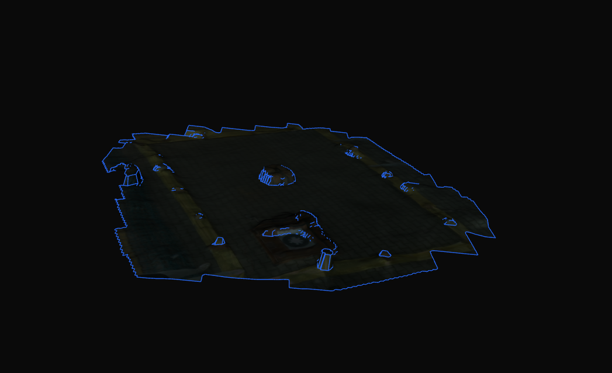

# 07 — Stage Guide (what runs, which file, key settings)

A practical, one-page-per-stage reference: **what happens**, **which file is doing it**, **the few
parameters that actually matter**, and **how to use / fix** each stage.

- Full theory → [HOW_IT_WORKS.md](../HOW_IT_WORKS.md)
- Every single parameter → [PARAMETERS_GUIDE.md](../PARAMETERS_GUIDE.md)

---

## 0. The whole run in one picture

```
  INPUT                          STAGE                      OUTPUT
  ─────                          ─────                      ──────
  drone_photos/*.jpg   ──►  1. STITCH        ──►  orthomosaic.jpg + photo_to_H
  coordinates.csv           iroc_pipeline.py

  orthomosaic.jpg      ──►  2. FIELD MAP     ──►  rectified_field.jpg + M_persp
                            iroc_pipeline.py
                            (+ _fixed override)

  targets/*.png (64)   ──►  3. MATCH         ──►  fused_results.csv, proof_hd/, lr_match/
  drone_photos_lr(128)      stage3_robust.py

  all of the above     ──►  4. COORDINATES   ──►  targets.json + annotated_field.jpg
                            iroc_pipeline_fixed.py

  drone_photos/*.jpg   ──►  5. 3D (optional) ──►  model.glb, dsm.tif, orthophoto.tif
                            3d.py
```

**One command runs stages 1–4:**

```bash
python3 iroc_pipeline_fixed.py
```

---

## Stage 1 — Stitching

**File:** `iroc_pipeline.py` → `run_stitching()` (pairing fixes live in `iroc_pipeline_fixed.py`)

### What is happening
Photos are joined into one top-view map. Each photo is paired with its **nearest neighbours by
VIO position**, matched with **LoFTR**, and all transforms are optimised together (bundle
adjustment) so errors don't accumulate. The result is `orthomosaic.jpg` plus `photo_to_H` — the
transform that later converts a photo pixel into a map pixel.

### Log lines you should see
```
[fix#12] stitch grid: 35/35 photos … (row,col) mila
[fix#13] spatial pairing: 35/35 photos, 140 pairs (VIO 8-NN + temporal)
    [ 12/140] … 791 inliers
Stitched 35/35 photos            ← should equal your photo count
```

### What a good result looks like


*The whole arena in one piece, straight edges, no doubled/ghosted features.*

### Key parameters (only these matter)

| Parameter | File | Default | Change it when |
|---|---|---|---|
| `GRID_RADIUS` | `iroc_pipeline.py` | `1` (8 neighbours) | Gaps in the mosaic → `2` (12 neighbours). Same as `--radius 2` |
| `MIN_INLIERS` | `iroc_pipeline.py` | `30` | Photos being dropped → lower to `20`. Wrong photos joining → raise to `40` |

### How to use / fix

```bash
python3 iroc_pipeline_fixed.py              # stitching runs (do NOT use --skip-stitch)
python3 iroc_pipeline_fixed.py --radius 2   # if the mosaic has gaps
```

| Symptom | Fix |
|---|---|
| `Stitched 15/35` (photos dropped) | Check `coordinates.csv` has `x_enu,y_enu`; then `--radius 2`, lower `MIN_INLIERS` |
| Mosaic skewed / smeared | Usually a pairing problem — confirm the `[fix#13]` line appears |
| Only part of the arena stitched | Confirm VIO positions exist for all photos |

---

## Stage 2 — Field map (straighten + scale)

**File:** `iroc_pipeline.py` → `setup_field_map()`, with `detect_yellow_corners()` and the scale
fix overridden in `iroc_pipeline_fixed.py`

### What is happening
The yellow boundary tape is detected by colour, its 4 corners are found, and the mosaic is warped
so the arena becomes a **straight rectangle**. That rectangle is then scaled to the **known arena
size**, which cancels VIO scale error. Output: `rectified_field.jpg` and `M_persp`.

### Log lines
```
[fix#8] fixed yellow OK (frac=0.043)          ← mask looks sane
[fix#3] TRUE size 10.67 x 7.62 m  (…-> width=35ft)
Field: 10.67 m x 7.62 m
```

### What a good result looks like

| Yellow mask (`yellow_mask_debug.jpg`) | Corners found (`yellow_corners_debug.jpg`) |
|:---:|:---:|
|  |  |
| Thin tape frame only — **no ground, no crate** | Red quad sitting on the actual boundary |

Rectified output (`rectified_field.jpg`) — straight and scaled to the real arena:


### Key parameters

| Parameter | File | Default | Change it when |
|---|---|---|---|
| `ARENA_LONG_FT` | `iroc_pipeline_fixed.py` | `35` | **Always set to your real arena's long edge** |
| `ARENA_SHORT_FT` | `iroc_pipeline_fixed.py` | `25` | **Always set to your real arena's short edge** |
| `YELLOW_S` | inside `detect_yellow_corners()` | `65` | Mask catching the ground → raise (75/85). Tape disappearing → lower (45/30) |

> Which edge is 35 and which is 25 is decided **automatically** from the pixel edge lengths — you
> only supply the two numbers.

### How to use / fix

**Always check this file first when coordinates look wrong:**

```
results/stage2_field/yellow_mask_debug.jpg
```

It must show a **thin tape frame and nothing else**.

| What you see in the mask | Fix |
|---|---|
| Big white blobs of ground/base station | Raise `YELLOW_S` |
| Tape missing / mask nearly empty | Lower `YELLOW_S` |
| Frame present but corners drift | Check `yellow_corners_debug.jpg`; keep the whole boundary inside the mosaic |

---

## Stage 3 — Target matching (feature detection) ⭐

**File:** `stage3_robust.py`

### What is happening
Each **64×64 seed** is converted by DINOv2 into an "object prototype" and a "background
prototype". Every **128×128 drone photo** is scored patch-by-patch → a heatmap whose peak is the
candidate location. The best photos are shortlisted, the candidate crop is compared with the seed
(cosine similarity over 4 rotations, plus a colour check), and only then is a target declared
**FOUND**.

### Log lines
```
Features: 3 | Drone photos: 35
Indexing drone photos (CLAHE + DINOv2 patches) …
[1] peak=0.31 V=0.72 → FOUND   cp0011_r01c02.jpg
[2] peak=0.09 V=0.31 → NOT FOUND
Found 3/3 targets
```

`peak` = how strongly the object appears · `V` (vsim) = how well the crop matches the seed.
**These two numbers are what you tune against.**

### What a good result looks like


*Each row: the seed reference (left) and where it was found in the survey photo (right, circled).
The green label shows confidence, source photo, `peak` and `V`.*

### Key parameters

| Parameter | File | Default | Change it when |
|---|---|---|---|
| `MIN_FOUND_PEAK` | `stage3_robust.py` | `0.14` | A real target says NOT FOUND → lower to `0.10` |
| `VERIFY_MIN` | `stage3_robust.py` | `0.45` | Real target rejected → lower to `0.40`. Wrong object matched → raise to `0.55` |
| `CENTER_PREF` | `stage3_robust.py` | `0.06` | Target detected half-cut at a photo edge → raise to `0.10` |
| `TOPK` | `stage3_robust.py` | `8` | Want more candidates considered → raise (slower) |

### How to use / fix

```bash
python3 iroc_pipeline_fixed.py --skip-stitch     # reuse the mosaic, re-run matching only (fast)
```

| Symptom | Fix |
|---|---|
| Real target NOT FOUND | Lower `MIN_FOUND_PEAK` and/or `VERIFY_MIN` |
| Circle on the wrong object | Raise `VERIFY_MIN` |
| Detection at the edge of a photo | Raise `CENTER_PREF` |
| Two targets on the same object | Handled in Stage 4 (`SEP_M`) |

Check the visuals: `results/stage3_targets/visuals/<target>.jpg` shows reference vs detection
side by side.

---

## Stage 4 — Coordinates

**File:** `iroc_pipeline_fixed.py` → `compute_map_coords()`, `_mutual_exclusion()`

### What is happening
The detected pixel is pushed through the chain
`photo → mosaic (photo_to_H) → rectified (M_persp) → metres (÷ PX_PER_M)`, then the base-station
position is subtracted so every coordinate is **relative to the base station**. Overlapping
targets are separated, and a target seen in several photos gets its positions averaged.

### Log lines
```
[fix#1 base-origin] base station @ field (0.720, 0.730) m -> subtracted
[avg] '1' 3 photos se averaged -> (3.79,1.92)
Target   Method          x(m)     y(m)     z(m)  Photo
1        stage3_robust   3.790    1.920    3.000  cp0011_r01c02.jpg
```

### Key parameters

| Parameter | File | Default | Change it when |
|---|---|---|---|
| `BASE_STATION_EXACT` | `iroc_pipeline_fixed.py` | `True` | Keep `True` — origin = base station (required by the rules). `False` = yellow corner |
| `HEADING_ROT_DEG` | `iroc_pipeline_fixed.py` | `0.0` | Coordinates must follow an assigned heading → set `90` / `180` / `270` |
| `SEP_M` | `iroc_pipeline_fixed.py` | `0.6` | Two targets genuinely closer than 0.6 m → lower it |
| `AVG_R` | `iroc_pipeline_fixed.py` | `0.5` | Coordinates jitter between runs → raise to `0.7` |

### How to use / fix

```bash
python3 iroc_pipeline_fixed.py --skip-match      # reuse matches, only recompute coordinates (fastest)
```

| Symptom | Fix |
|---|---|
| Every coordinate shifted by the same amount | Check the `[fix#1 base-origin]` value — the base station must be near takeoff |
| Axes rotated vs what judges expect | Set `HEADING_ROT_DEG` |
| Two targets reported at one spot | Look for `[fix#9 WARN]`, adjust `SEP_M` |
| Coordinates wobble run to run | Raise `AVG_R` |

**Deliverables produced here**

```
results/stage3_targets/targets.json           ← coordinates (map_xyz)
results/stage3_targets/proof_hd/<t>.jpg       ← HD image, feature-centred, ≥720 px
results/stage3_targets/lr_match/<t>.png       ← LR image, 128×128
results/stage4_annotated/annotated_field.jpg  ← annotated arena map
```

### What a good result looks like


*Every found target circled on the rectified arena, labelled with its `x, y, z` in metres from the
base station.*

---

## Stage 5 — 3D reconstruction (optional)

**File:** `3d.py` (OpenDroneMap in Docker)

### What is happening
SIFT features → matching → **SfM** (camera poses + sparse cloud) → **MVS** (dense cloud) → mesh →
texture. Also produces a **DSM** (elevation grid) and an **orthophoto** (true-scale colour map),
which `3d.py` fuses into a coloured point cloud.

### What a good result looks like

| Top-down | Angled |
|:---:|:---:|
|  |  |



*The whole arena reconstructed — yellow boundary, base station and every feature. Blue outlines
are mesh edges. The low-angle view shows the elevation the DSM recovers.*

### Key parameters

| Parameter | File | Default | Change it when |
|---|---|---|---|
| `--pc-quality` | `3d.py` (`EXTRA_OPTIONS`) | `high` | Too slow / low RAM → `medium` |
| `--min-num-features` | `3d.py` | `16000` | Reconstruction failing → keep high; speed → lower |
| `HEIGHTMAP_DOWNSAMPLE` | `3d.py` | `2` | Point cloud too heavy → `4` |

### How to use

```bash
python3 iroc_pipeline_fixed.py --run-3d   # pipeline + 3D
python3 3d.py                             # 3D only (Docker required)
python3 3d.py --skip-odm --view           # re-render from existing ODM output
```

Outputs → `results/3d_map/` (`model.glb` opens in Windows 3D Viewer / Blender / MeshLab).

---

## Which file does what (short version)

| File | Runs in | Job |
|---|---|---|
| `iroc_pipeline_fixed.py` | **you run this** | Main entry; config flags; fixed versions of the buggy functions |
| `iroc_pipeline.py` | imported | Stage 1 stitching, Stage 2 field map, Stage 4 base logic, annotation |
| `stage3_robust.py` | subprocess | Stage 3 matcher (DINOv2 semantic search) |
| `fused_search.py` | imported | Loads LoFTR/DINOv2, image resizing, seed grouping, builds `drone_photos_lr/` |
| `3d.py` | optional | Stage 5 photogrammetry |
| `make_lr.py` | manual | Full-res references → LR seeds |
| `make_test_dataset.py` | manual | Synthetic arena + flight with known ground truth |
| `base_station/server.py` | dashboard | Web API, telemetry, images, docking endpoints |
| `base_station/pipeline_runner.py` | dashboard | Launches the pipeline, streams its log to the browser |
| `base_station/drone_link/mavlink_link.py` | dashboard | Live MAVLink telemetry (PX4) |
| `esp32_firmware/…ino` | ESP32 | Docking rods, contact/polarity, voltage, charging |

---

## The run flags

| Command | What it does | Use when |
|---|---|---|
| `python3 iroc_pipeline_fixed.py` | Stages 1→4 | New data / first run |
| `… --skip-stitch` | Reuse mosaic, redo matching + coordinates | Tuning Stage 3 |
| `… --skip-match` | Reuse matches, redo coordinates only | Tuning Stage 4 (fastest) |
| `… --radius 2` | More stitch pairs | Mosaic has gaps |
| `… --run-3d` | Also run 3D | Need the 3D map |

---

## Tuning workflow (do this in order)

1. Run everything: `python3 iroc_pipeline_fixed.py`
2. Read the log for the marker lines of each stage (shown above).
3. Look at, in this order:
   `orthomosaic.jpg` → `yellow_mask_debug.jpg` → `visuals/<target>.jpg` → `annotated_field.jpg`
4. Change **one** parameter, re-run with the fastest flag that still covers it
   (`--skip-match` < `--skip-stitch` < full run), and compare.

> Rule of thumb: fix the earlier stage first. A bad mosaic makes Stage 2 wrong, which makes every
> coordinate wrong — no amount of Stage 3 tuning fixes that.

---

**See also:** [04 — Pipeline detail](04_PIPELINE.md) · [PARAMETERS_GUIDE.md](../PARAMETERS_GUIDE.md) · [RUN_GUIDE.md](../RUN_GUIDE.md)
