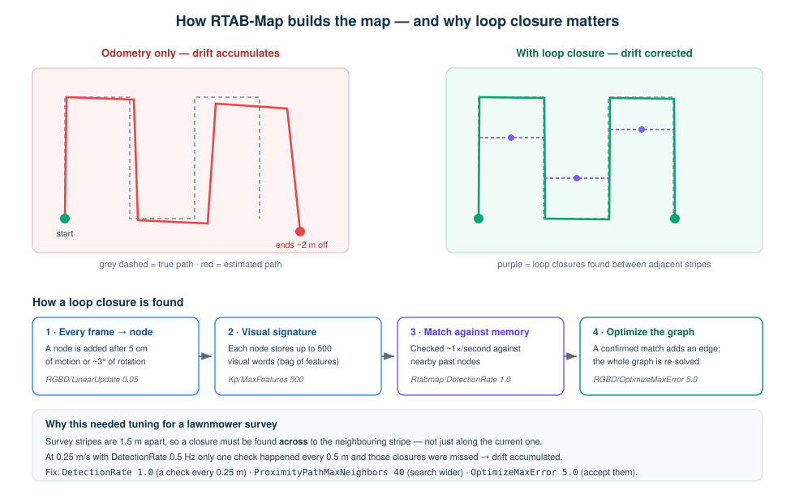

# 10 — VIO & Localization (how the drone knows where it is, without GPS)

How optical flow and visual odometry are combined, how the handover between them is gated, and
what happens when the camera fails.

---

## 1. Two position sources, deliberately

| | **Optical flow** (MTF-01) | **Visual odometry** (RTAB-Map + D455) |
|---|---|---|
| Measures | ground velocity + height | absolute position + yaw |
| Strength | extremely robust, works on almost any surface | no long-term drift, gives a map |
| Weakness | position **drifts** (velocity is integrated) | **can fail** — low texture, glare, motion blur, close range |
| Used for | takeoff, landing, and as the always-on fallback | the mission itself, once proven trustworthy |

**They are not alternatives — both run at the same time.** In PX4:

```
EKF2_OF_CTRL = 1     ← optical flow fusion always ON
EKF2_EV_CTRL = 9     ← external vision: horizontal position + yaw
EKF2_GPS_CTRL = 0    ← GPS completely disabled
```

The EKF fuses whatever it is given. So "switching" is not a mode change on the drone — it is
simply **whether vision poses are being published at all**. That is what `vio_gate` controls.

```
gate CLOSED → nothing on /mavros/vision_pose/pose → EKF runs on flow alone
gate OPEN   → 30 Hz vision poses                  → EKF fuses flow + vision
```

This is the safest possible design: the fallback is not a recovery path that has to work under
stress — it is the **normal state**, always running underneath.

---

## 2. `vio_gate` — the trust decision

VIO is never trusted just because it is producing output. It has to earn the gate opening, and it
keeps being watched afterwards.

### 2.1 The initialization factor

```
IF = Q × A × S            (each term 0…1, so IF is 0…1)
```

| Term | Question it answers | Computed from |
|---|---|---|
| **Q — quality** | Is the tracker itself confident? | RTAB-Map pose covariance, normalised by `cov_norm` (50). Covariance ≥ `cov_bad` (100) = tracking lost. |
| **A — agreement** | Does VIO agree with what the EKF already believes? | Position difference over a `window_secs` (2 s) window, tolerance `agree_tol_m` (0.5 m). |
| **S — stability** | Is the motion consistent, not jittering? | Velocity standard deviation over the same window, tolerance `vel_tol_ms` (0.5 m/s). |

Because the three multiply, **any one of them collapsing collapses IF**. A tracker can be
internally confident (high Q) while disagreeing with reality (low A) — that product is correctly
low.

### 2.2 State machine

```
 0 UNSEEDED ──seed()──► 1 SEEDING ──settle──► 2 VALIDATING ──IF ≥ min, held──► 3 OPEN
                                                    │                             │
                                                    └──── timeout ────► fault ◄────┘ watchdog trip
                                                                        (4/5/6)
```

| State | Meaning |
|---|---|
| `0` | Not seeded — gate closed, flow only |
| `1` | Seeding — odometry reset, capturing the VIO↔EKF alignment |
| `2` | Validating — scoring IF while the mission flies a small motion test |
| `3` | **OPEN** — vision pose flowing to PX4 |
| `4/5/6` | Fault — gate closed automatically (see watchdogs) |

Live view: `ros2 topic echo /viman/init_factor` and `/viman/vio_state`.

### 2.3 Seeding

RTAB-Map starts its own frame wherever it happens to initialise, which will not match the EKF
frame. On `seed`:

1. Odometry is reset (`reset_service`).
2. After `seed_settle_secs`, the current VIO pose and the current EKF pose are captured.
3. The transform between them is stored, and every later VIO pose is expressed **relative to that
   seed** before being published.

Without this, a Z offset in the published pose shifts the EKF's altitude estimate — the drone
overshoots on climb and can strike the ground on landing.

### 2.4 Validation

The mission flies a small square (`motion_amp_m` 0.2 m, `motion_leg_s` 4 s per leg) while the gate
watches. The gate opens only when:

```
IF ≥ validate_if_min  (0.5–0.7)   held for validate_hold_s (5 s)
```

Brief dips are tolerated for `validate_dip_grace_s` (1 s). If it never holds within
`validate_timeout_s` (60 s), the mission lands on flow rather than flying on unproven VIO.

**Why a motion test:** a stationary tracker can look perfect and still be wrong. Only movement
reveals whether VIO and the EKF agree about *displacement*.

### 2.5 Watchdogs (running the whole time the gate is open)

| Watchdog | Trips when | Parameter |
|---|---|---|
| **Divergence** | VIO and EKF positions drift apart | `divergence_max_m` (9.0) |
| **Jump** | Pose teleports in a single frame — the classic sign of an RTAB-Map internal reset | `jump_max_m` (6.0) |
| **Covariance spike** | Pose variance stays bad for several consecutive frames | `cov_spike` (0.0225 ≈ σ > 0.15 m) for `cov_spike_frames` (6) |

On any trip: **the gate closes immediately** and the drone continues on flow. The mission then
holds, re-seeds and re-validates, up to `max_revalidations` times (6 on the survey).

> The thresholds carry their flight history in the YAML comments — e.g. `cov_spike_frames` was
> raised from 2 to 6 because single-frame quality glitches over texture-poor patches were closing
> the gate unnecessarily, while genuine tracking loss always sustains far longer.

---

## 3. RTAB-Map — what it does and how it is set up

### 3.1 The two nodes

RTAB-Map is not one process. The launch file starts **two**, with very different jobs:

| Node | Job | Timing | Failure impact |
|---|---|---|---|
| **`rgbd_odometry`** | Frame-to-frame visual odometry — "how far did I move since the last image?" | Every frame, ~30 Hz | **Flight-critical** — this is what feeds the pose to PX4 |
| **`rtabmap`** | SLAM — builds the map graph, finds loop closures, corrects drift | ~1 Hz, asynchronous | Not flight-critical — a slow map does not destabilise flight |

This split is why the tuning is asymmetric: odometry settings are conservative (it must never
stall), while map settings can be heavier.

### 3.2 Loop closure — how drift gets corrected



Odometry alone always drifts: each frame's small error adds to the last. Loop closure fixes this
by **recognising a place it has already seen** and inserting a constraint into the graph.

| Step | What happens | Parameter |
|---|---|---|
| 1 | A **node** is added after 5 cm of motion or ~3° of rotation | `RGBD/LinearUpdate 0.05`, `RGBD/AngularUpdate 0.05` |
| 2 | Each node stores a **visual signature** — up to 500 visual words | `Kp/MaxFeatures 500` |
| 3 | About once a second, the current view is **matched against nearby past nodes** | `Rtabmap/DetectionRate 1.0` |
| 4 | A confirmed match adds an **edge**; the whole graph is re-optimised | `RGBD/OptimizeMaxError 5.0` |

**Why this needed tuning for a lawnmower survey:** the stripes are 1.5 m apart, so useful closures
are the ones found **across to the neighbouring stripe**. At 0.25 m/s with `DetectionRate 0.5`
there was only one check every 0.5 m and those closures were being missed, so drift accumulated.
Three changes fixed it — a check every 0.25 m (`DetectionRate 1.0`), a wider neighbour search
(`ProximityPathMaxNeighbors 40`) and a looser acceptance threshold (`OptimizeMaxError 5.0`, up
from 3.0, because valid closures were being rejected at error ratios of 3.02–3.12).

> **Loop closure does not help the drone in flight** — the pose sent to PX4 comes from
> `rgbd_odometry`. Closures make the *stored map* consistent, which is what matters when the
> database is reprocessed after landing.

### 3.3 Installing and launching RTAB-Map

```bash
sudo apt install -y ros-humble-rtabmap-ros ros-humble-rtabmap-launch
```

It is never launched by hand — `bringup.launch.py` / `survey_boundary.launch.py` include it with
the tuned preset:

```python
from viman_mission.rtabmap_config import robust_flight_launch_args

IncludeLaunchDescription(
    PythonLaunchDescriptionSource(rtabmap_launch),
    launch_arguments=robust_flight_launch_args(db_path),
)
```

To run it separately, launch with `start_rtabmap:=false` so it is not started twice.

### 3.4 Inputs it needs

| Input | Topic | Requirement |
|---|---|---|
| Colour | `/camera/camera/color/image_raw` | 1280×720 @ 30 fps |
| Depth | `/camera/camera/depth/image_rect_raw` | **aligned to colour** |
| Camera info | `/camera/camera/color/camera_info` | intrinsics |
| Frame | `camera_link` | published by `rs_pipeline` |
| Sync | `approx_sync:=false` | **exact** sync — possible because `rs_pipeline` hardware-stamps frames |

`approx_sync:=false` matters: approximate sync pairs colour and depth frames that were captured at
slightly different times, which shows up as pose noise.

### 3.5 How the parameters are passed (a real trap)

`rtabmap.launch.py` takes three separate argument channels, and mixing them up causes silent
failures:

| Channel | Goes to | Rule |
|---|---|---|
| `args` | **both** nodes | Safe for `Vis/*`, `GFTT/*`, `Kp/*` |
| `odom_args` | `rgbd_odometry` only | **`Odom/*` and `OdomF2M/*` must go here** — `rtabmap` does not declare them and crashes with `ParameterNotDeclaredException` |
| `rtabmap_args` | `rtabmap` only | ⚠️ **silently ignored** by this launch file — confirmed from flight logs showing defaults despite being set |

Because `rtabmap_args` is ignored, the map-node parameters (`DetectionRate`, `OptimizeMaxError`,
`NotLinkedNodesKept`) had to be moved into `args`; `rgbd_odometry` simply ignores keys it does not
recognise. Also, `OdomF2M/BundleAdjustment` must be passed via `odom_args` — in the `:=` form it
gets overridden back to 1 by the parameter flood, which produced "Too low inliers after bundle
adjustment" quality drops.

### 3.6 Parameter reference

All of it lives in one place: `rtabmap_config.py`.

The guiding principle:

> **Live RTAB-Map has exactly one flight-critical job: stable odometry.**
> Map quality comes from reprocessing the stored database offline. So compute settings are
> conservative, and only *storage* settings are max-quality — they cost SSD, not CPU.

| Area | Setting | Reason |
|---|---|---|
| Features | `Vis/MinInliers 6` | 8 was failing on low-texture arena floor |
| | `GFTT/MinDistance 6` | 4 saturated the Jetson (odometry dropped to 3–5 Hz) |
| | `Vis/MaxFeatures 600`, `Kp/MaxFeatures 500` | CPU headroom at 30 Hz |
| Odometry | `OdomF2M/BundleAdjustment 0` | BA over-filtered inliers in flight |
| | `OdomF2M/MaxSize 1500` | 3000 made update time grow 0.116 s → 0.313 s as the map filled |
| | `Odom/GuessMotion true` | IMU guess keeps RANSAC fast; disabling it caused 3–5 Hz odometry |
| Loop closure | `Rtabmap/DetectionRate 1.0` | 0.5 Hz missed adjacent survey stripes (1.5 m apart) |
| | `RGBD/OptimizeMaxError 5.0` | 3.0 was rejecting valid closures between stripes |
| | `RGBD/ProximityPathMaxNeighbors 40` | finds closures across to the neighbouring stripe |
| Storage | `Mem/ImagePreDecimation 1`, `NotLinkedNodesKept true` | full-resolution frames kept for offline reprocessing |

### 3.7 Inspecting the map after a flight

The database is written to `/media/jetson/ROS2_SSD/maps/flight_<timestamp>.db`.

```bash
# graphical inspector — nodes, loop closures, 3D cloud, per-frame features
rtabmap-databaseViewer /media/jetson/ROS2_SSD/maps/flight_<ts>.db

# summary
rtabmap-info flight_<ts>.db

# rebuild at max quality (offline — never during flight)
rtabmap-reprocess --Vis/MaxFeatures 2000 --Kp/MaxFeatures 1500 \
  --Rtabmap/DetectionRate 4 flight_<ts>.db out.db

# export the point cloud
rtabmap-export --cloud --output cloud.ply flight_<ts>.db
```

In `rtabmap-databaseViewer`, **Graph View** shows the trajectory with loop-closure links drawn
between nodes — that is the picture of what the diagram above describes, on your own flight.

> **Add your own screenshots here.** A Graph View image and a 3D cloud image from a real flight
> make this section far easier to follow. Save them to `docs/images/` and reference them.

### 3.8 Tuning checklist

| Symptom | Look at |
|---|---|
| Odometry rate below ~15 Hz | `GFTT/MinDistance` (raise), `Vis/MaxFeatures` (lower), `OdomF2M/MaxSize` (lower) |
| "Odometry lost" on plain floor | `Vis/MinInliers` (lower), `GFTT/QualityLevel` (lower) |
| Update time grows during a long flight | `OdomF2M/MaxSize` — the local map is growing |
| Drift between survey stripes | `Rtabmap/DetectionRate`, `ProximityPathMaxNeighbors`, `OptimizeMaxError` |
| Loop closures rejected | `RGBD/OptimizeMaxError` (raise) |
| Map looks poor but flight was stable | Expected — reprocess offline |

---

## 4. The camera pipeline (`rs_pipeline`)

| Setting | Value | Why |
|---|---|---|
| Resolution / rate | 1280×720 @ 30 fps | matches the survey imagery |
| `laser_power` | 360 (max) | best depth quality |
| `rgb_ae_limit_us` | 800 µs | caps exposure so motion blur stays negligible (~0.06 px at 0.4 m/s); raised from 200 µs after a flight where AE hit the ceiling in dim light |
| `spatial_filter` | true | smooths depth |
| `hole_filling` | **false** | **never enable for VIO** — invented depth corrupts odometry |
| `hw_reset_on_start` | true | power-cycles the USB device, healing a stuck camera |
| `reliable_qos` | true | RTAB-Map subscribes RELIABLE by default |

> **Never run two camera drivers at once.** If you start your own, launch with `start_camera:=false`.

---

## 5. What happens when the camera fails

This is the question that matters most, so it is answered explicitly.

| Failure | Detected by | Result |
|---|---|---|
| Tracking quality collapses | `cov_spike` × `cov_spike_frames` | Gate closes → **flow only**, mission holds, re-seed + re-validate |
| VIO drifts away from EKF | `divergence_max_m` | Gate closes → flow only → re-validate |
| RTAB-Map internal reset (pose jump) | `jump_max_m` | Gate closes → flow only → re-validate |
| Camera stops publishing | odometry stops arriving | Gate closes (no pose to forward) → flow only |
| Repeated failures | `max_revalidations` exhausted | Mission **returns home and lands on flow** |
| Offboard link lost entirely | PX4 `COM_OBL_RC_ACT` | PX4 executes its configured failsafe action |
| Pilot intervenes | RC CH5 ≥ `rc_interrupt_high` | Mission releases control immediately — the pilot always wins |

**The key property:** losing the camera never removes the drone's ability to fly. Optical flow is
already fused and keeps it stable — the loss only costs absolute position accuracy, and the
response is to stop, hold, and either recover VIO or come home.

Landing is flow-only *by design*, and the gate is closed `flow_settle_s` (2.5 s) **before** descent
begins, so the EKF is already settled on flow while still at altitude — never during the descent.

---

## 6. Frames and conventions

| Frame | Convention |
|---|---|
| ENU (`x` East, `y` North, `z` Up) | MAVROS / mission setpoints |
| Body FLU (forward-left-up) | boundary vectors, stick mapping |
| Camera optical | RTAB-Map input; `camera_link` published by `rs_pipeline` |

Mission yaw: by default the drone **holds the heading it had when armed**
(`yaw_use_arm_heading: true`) — you set the survey direction simply by facing the drone before
arming. After slewing, the grid frame is re-locked to the drone's *actual* settled yaw, so stripes
fly straight along the real body axes instead of skewing by the residual PX4 yaw error.

---

**Next:** [11 — Pixhawk & PX4](11_PIXHAWK_PX4.md)
